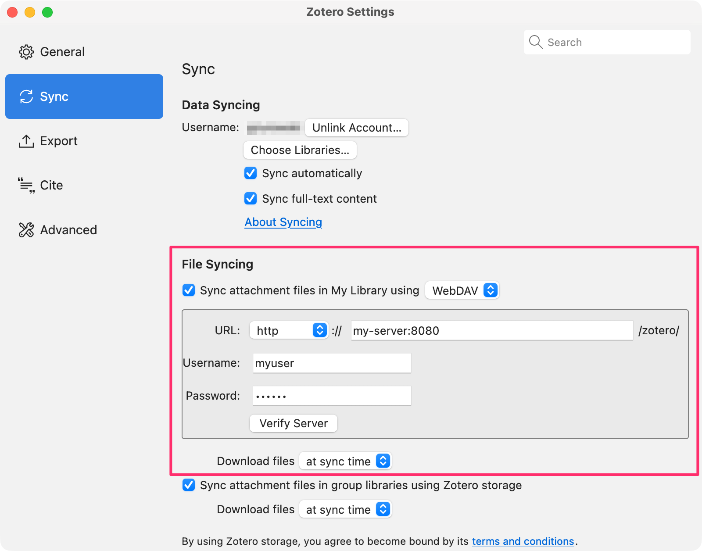

# Zotero DAV

[](https://hub.docker.com/r/gzurowski/zotero-dav)

A Docker image providing WebDAV access for Zotero, built on the official Nginx Alpine Linux image.

## Quick Start

> **Important:** Replace `myuser` and `mysecretpassword` in the examples below with your own credentials.

### Using Docker

```sh
docker run -d \
  --name zotero-webdav \
  -p 8080:80 \
  -e ZOTERO_USER=myuser \
  -e ZOTERO_PASS=mysecretpassword \
  -v zotero-data:/var/lib/dav/data \
  gzurowski/zotero-dav
```

### Using Docker Compose

Create a `docker-compose.yml`:

```yaml
services:
  zotero:
    image: gzurowski/zotero-dav
    ports:
      - "8080:80"
    environment:
      - ZOTERO_USER=myuser
      - ZOTERO_PASS=mysecretpassword
    volumes:
      - zotero-data:/var/lib/dav/data

volumes:
  zotero-data:
```

Then run:

```sh
docker compose up -d
```

## Configuration

| Environment Variable | Default  | Description                 |
| -------------------- | -------- | --------------------------- |
| `ZOTERO_USER`        | `zotero` | WebDAV username             |
| `ZOTERO_PASS`        | `zotero` | WebDAV password             |
| `UID`                | `101`    | User ID for file ownership  |
| `GID`                | `101`    | Group ID for file ownership |

## Configuring Zotero

1. Open Zotero and go to **Settings**
2. Select the **Sync** tab
3. Under **File Syncing**, check **Sync attachment files in My Library**
4. Select **WebDAV** from the dropdown
5. Enter your server details:
   - **URL:** `http://my-server:8080/zotero/`
   - **Username:** Your configured username (e.g., `myuser`)
   - **Password:** Your configured password
6. Click **Verify Server** to test the connection



## Development

Clone this repository:

```sh
git clone https://github.com/gzurowski/zotero-dav.git
```

### Build

```sh
docker compose build
```

### Run

```sh
docker compose run --build
```

The server will be available at http://localhost:8888 with default credentials `zotero:zotero`.

### Test

```sh
# Health check
curl http://localhost:8888/health

# List directory
curl -u zotero:zotero -X PROPFIND http://localhost:8888/zotero/

# Upload a test file
echo "Hello Zotero!" | curl -u zotero:zotero -T - http://localhost:8888/zotero/test.txt

# Download the file
curl -u zotero:zotero http://localhost:8888/zotero/test.txt

# Delete the file
curl -u zotero:zotero -X DELETE http://localhost:8888/zotero/test.txt
```

Uploaded files are stored in the `./data` directory.

## Issues

If you encounter any problems or have suggestions, please [open an issue](https://github.com/gzurowski/zotero-dav/issues).
